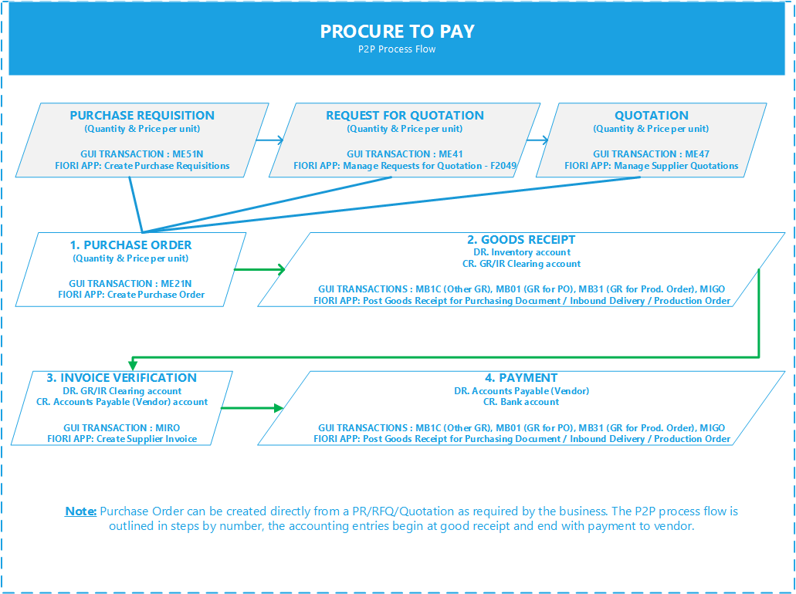

# SAP ACCOUNTING

```
DOCS related to Accounting

```
"Accounting or accountancy is the measurement, processing, and communication of financial and non financial information about economic entities such as businesses and corporations. Accounting, which has been called the "language of business", measures the results of an organization's economic activities and conveys this information to a variety of users, including investors, creditors, management, and regulators. Practitioners of accounting are known as accountants. The terms "accounting" and "financial reporting" are often used as synonyms." - from Wikipedia.

## Classification of Accounting:

1. Real accounts - (e.g. Assets – Tangible, Goodwill - Intangible)
2. Personal accounts - (e.g. Persons - Customers, Vendors or Individuals)
3. Nominal accounts - (e.g. Expenses, Incomes or gains transferred to Retained Earning of each year)

Rules of accounting for debits and credits:

| Description | INCREASE | DECREASE	|
|----------------------|-------|--------|
| ASSET |	Debit |	Credit |		
| EXPENSES | Debit | Credit |		
| LIABILITY |	Credit | Debit |		
| REVENUE	| Credit | Debit |		


## Accounting Entries by process flow in SAP:

### Procure to pay process - (FI-MM Integration):

[](https://www.sap.com "SAP")

1. Generating purchase requisition( PP-MM) - ME51N
2. Making inquiries (MM)  
3. Raising purchase order (MM) - ME21N
4. Release of purchase order ( MM) - ME29N
5. Goods received from vendor ( MM and FI ) - MIGO
Entry will be:

```
Raw Material Inventory a/c Dr.
  GR/IR clearing a/c Cr.

```
6. Invoice verification and quality assurance (FI and MM) - MIRO
Entry will be:

```
GR/IR clearing a/c Dr
  Vendor a/c Cr  

```
7. Vendor PAYMENT - F110 (Payment Processing Run - Checks)

```
Vendor a/c Dr
  Cash/Bank a/c Cr  

```
Note: Incoming Bank Statement: FF_5

### Order to cash process - (FI-SD Integration):

1. Generating a Sales Quotation (from CRM) - VA21
2. Creating a Sales Order (SD) - VA01
3. Outbound Delivery (SD) - VL01N
4. Goods Issues to Customer (SD and FI) - VL02N
Entry will be:

```
Goods consumption / COGS a/c - GBB Dr
  Inventory - BSX Cr

```
5. Billing/Invoice generated for Customer (SD and FI) - VF01
Entry will be:

```
Customer a/c Dr
  Revenue a/c Cr
  Customs Duty Payable a/c Cr
  Sales Tax Payable a/c Cr  


```
6. Receipt of payment from Customer (FI) - F.28
Entry will be:

```
Incoming Cash/Bank a/c Dr
  Customer a/c Cr
  Gain/Loss on FX a/c Cr

```
7. Lockbox & EBS
   - Lockbox Processing Transaction Codes
    - FLB2 (Import file) &
    - FLB1 (Post processing - Execute)
   - EBS for Incoming Bank Statement - FF_5

### Asset Accounting Entries:

1. Asset Acquisition: (Create Asset Master Record: AS01)

```
Fixed Asset – Acquisition Cost Dr
  Cash/Bank a/c Cr

```

2. Asset Acquisition from Vendor: F-90

```
Fixed Asset – Acquisition Cost Dr
  Vendor (Accounts payable) Cr

```
3. Asset Disposal – Sales to a Customer using F-92

```
Customer account (A/R) Dr	10,000
Accumulated depreciation Dr	1000
Clearing account for asset disposal Dr	10,000
  Revenue for asset disposal Cr	10,000
  Fixed asset – acquisition cost Cr	9,000
  Gain/loss of fixed asset disposal Cr	2000

```
Note: Asset having a book value of $9K and accumulated depreciation of $1K is sold to a customer for $10K.

4. Asset Disposal - Scrap without Revenue:

```
Gain/Loss on F.A Disposal Dr 8000
Accumulated Depreciation Dr 1000
  Fixed Asset acquisition cost Cr 9000
```
Note: Loss of $8K written off to P&L

## Global SAP Chart of Accounts:

<iframe src="https://drive.google.com/file/d/1rtWyaN4R4l0IbTeOfNwJquvXB9ni0g8W/preview" width="640" height="480"></iframe>
