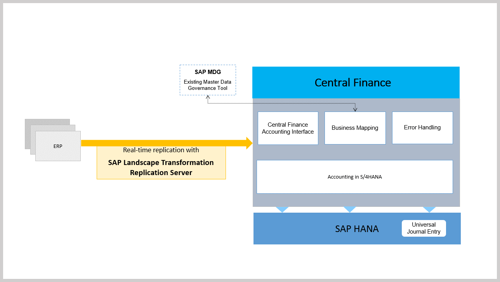

# Central Finance - CFIN

```
Central Finance - Overview

```
## Overview

With Central Finance, you can transition to a centralized SAP S/4HANA on-premise edition without disruption to your current system landscape, which can be made up of a combination of SAP systems of different releases
and accounting approaches and non-SAP systems. This allows you to establish a Central Reporting Platform for FI/CO with the option of creating a common
reporting structure.

## Replication Scenarios in Central Finance

- Replication of FI/CO postings

- Replication of CO internal postings

- Replication of cost objects

- Replication of commitments

- Replication of EC-PCA postings

- Replication of material cost estimates

- Replication of activity rates

## SAP LT Replication Server

[](https://www.sap.com "SAP")

SAP LT Replication Server collects data written to databases in the source systems and feeds this data into the corresponding Central Finance accounting interface. Replication of a defined subset of logistics data from purchase orders, sales orders, customer invoices (billing documents), supplier invoices (Accounting View of Logistics Information (AVL)

SAP LT Replication Server is also used for the initial load of CO internal postings and cost objects. The initial load of FI data is managed via Customizing activities in the Central Finance system. You can access these Customizing activities in the Implementation Guide (IMG) by starting transaction SPRO and then choosing:

```
Financial Accounting -->  Central Finance --> Central Finance: Target System Settings -->  Initial Load -->  Initial Load Execution for Financial Accounting.

```

