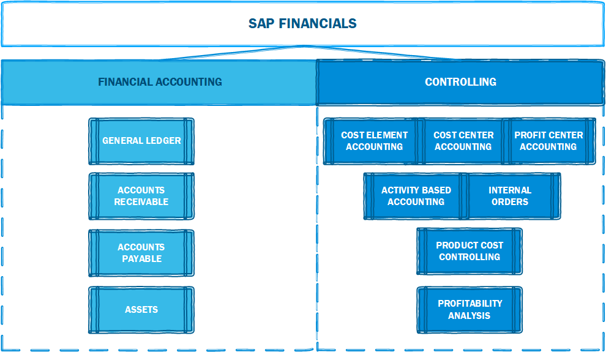
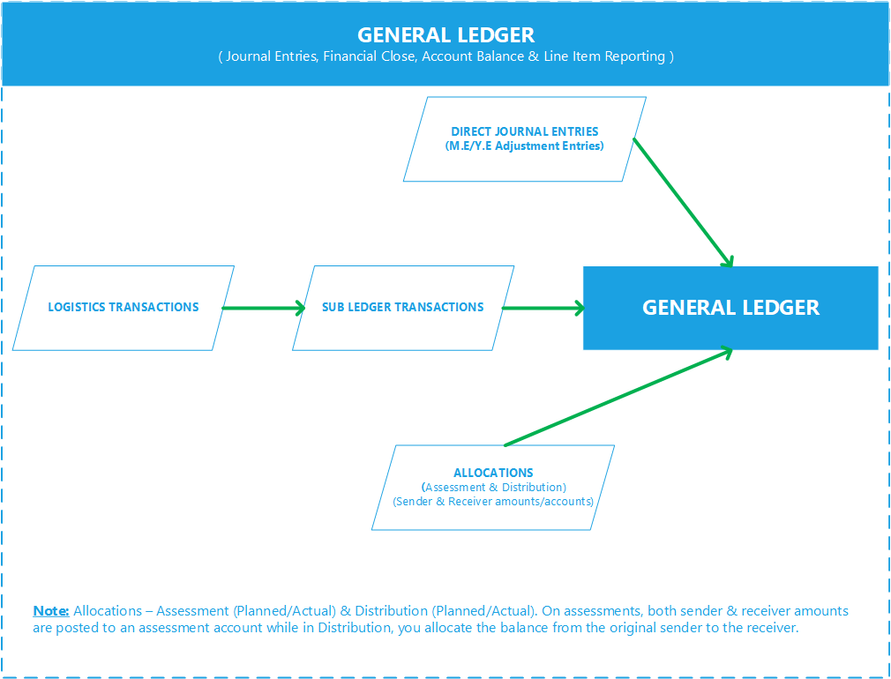
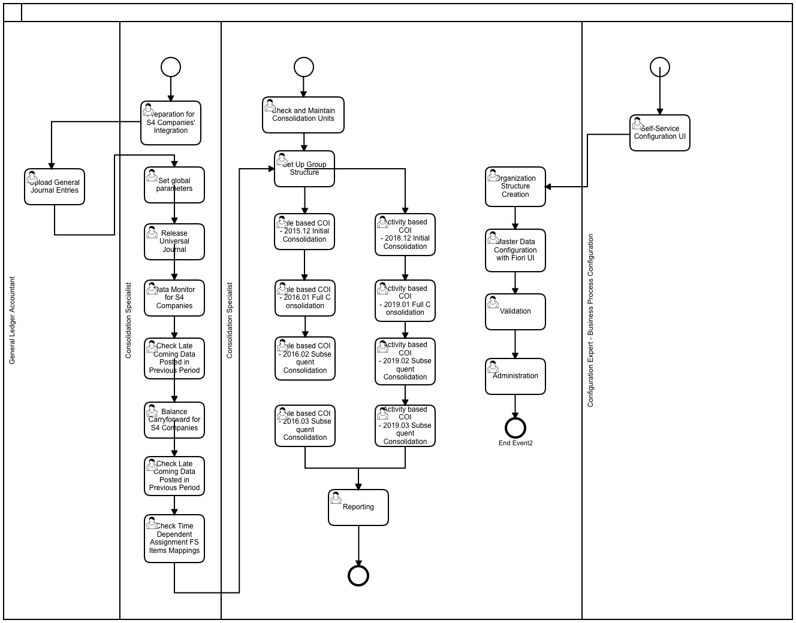
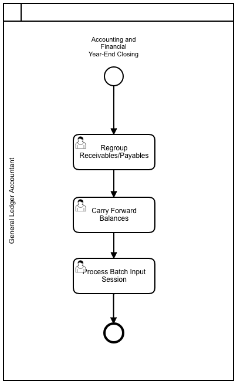
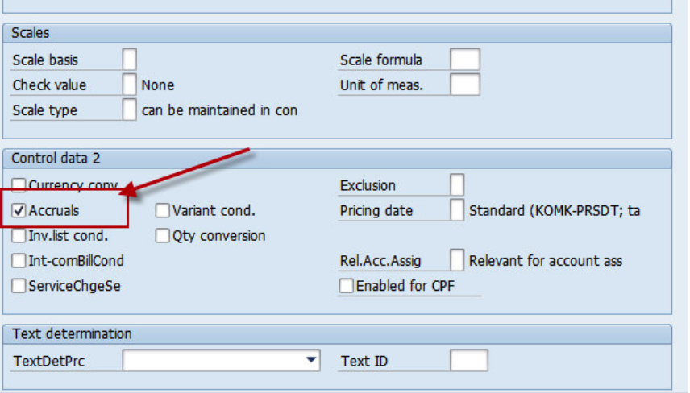
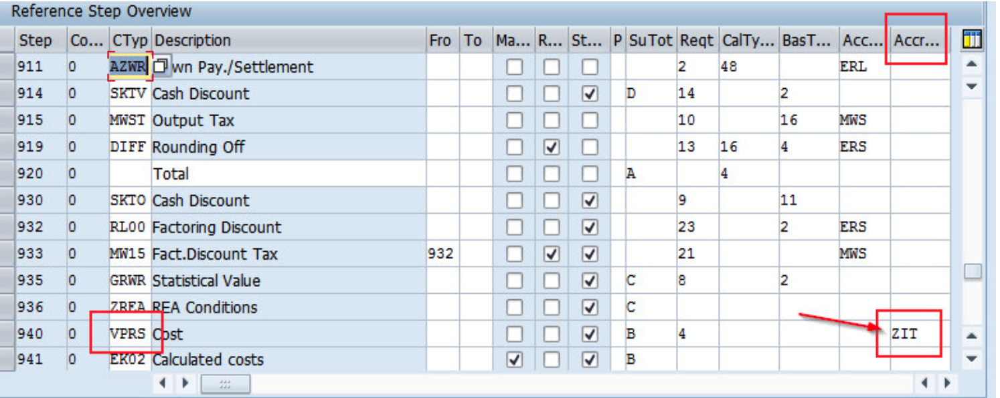

# SAP FINANCE MODULE

```
DOCS FOR SAP FI

```

Commands:

```
SAP FINANCE

```

## Process Modeling:

### Finance Process Flow

[](https://www.sap.com "SAP")

[](https://www.sap.com "SAP")

[](https://www.sap.com "SAP")


### Group Reporting - Financial Consolidation

[](https://www.sap.com "SAP")

### Year End Closing:

[](https://www.sap.com "SAP")

### Period End Closing:

[](https://www.sap.com "SAP")

## SAP Best Practices Receivables Account Structure:

<iframe src="https://drive.google.com/file/d/1IaNAkDCaUiO9GrAGyqBnNBzEc2-ZV6Yu/preview" width="640" height="480"></iframe>

## SAP Best Practices Payables Account Structure:

<iframe src="https://drive.google.com/file/d/10KwGNvrL5ZotuMeXfRbHVYLj73cm7vnk/preview" width="640" height="480"></iframe>

## Matching Principle:

Revenue and COGS should be posted in the same period as per Matching Principle in Accounting. SAP standard set up is to post COGS at Goods Issue but this can be configured per business requirement. If your business process includes Goods Issue without Billing in one period then change SAP setup to post COGS at Billing instead of at Goods Issue.

### Steps to Post COGS at Billing:

1. Transaction OBYC > GBB > VAX > Goods in transit account:

Switch the COGS account with a Goods in Transit Account, the goods issue entry will change to below

[](https://docs.sajivfrancis.com "SAP")

2. Transaction V/08 > Pricing Procedure > VPRS > Accrual Account Key:

Maintain a new account key and assign to VPRS:

[](https://docs.sajivfrancis.com "SAP")

3. Transaction VKOA > Assign GL Accounts to the new Account Key:

Assign COGS account in the provision column and Goods in Transit in GL column:

[](https://docs.sajivfrancis.com "SAP")

4. Change VPRS condition to accept accruals:

This tells SAP to post the VPRS value to the 2 accounts maintained in VKOA:

[](https://docs.sajivfrancis.com "SAP")

5. Billing Document Posted as below:

[](https://docs.sajivfrancis.com "SAP")


## Tables:

### Universal Journal

[](https://www.sap.com "SAP")

[](https://www.sap.com "SAP")


### List of tables

| Table | Name | S/4HANA - Notes |
|-------|------|-----------------|
| SKA1 | G/L Account Master (Chart of Accounts) | GLACCOUNT_TYPE for Cost Element Definition. Logical Database BRF GLU3 SDF. |
| SKAT | G/L Account Master Record (Chart of Accounts: Description) |  |
| SKB1 | G/L account master (company code) | In Logical Database BRF GLU3 SDF. |
| BKPF | Accounting Document Header | In Logical Database BMM BRF BRM DDF KDF SDF. |
| BSEG | Accounting Document Segment | In Logical Database BMM BRF BRM DDF KDF SDF. |
| VBKPF | Document Header for Document Parking |  |
| BSEG_ADD | Entry View of Accounting Document | When the document is not relevant for the leading ledger. |
| FAGLFLEXA | General Ledger: Items |  |
| FAGLFLEXP | General Ledger: Plan Line Items |  |
| FAGLFLEXT | General Ledger: Totals |  |
| ACDOCA | Universal Journal Entry Line Items |  |
| ACDOCC | Consolidation Journal |  |
| ACDOCP | Plan Data Line Items |  |
| T007A | Tax Keys |  |
| T007B | Tax Processing in Accounting |  |
| T007S | Tax Code Names |  |
| T030K | Tax Accounts Determination |  |
| T059A | Type of Recipient For Vendors |  |
| T059B | Withholding Tax Classes for Vendors: Names |  |
| T059C | Types of Recipient: Vendors per Withholding Tax Type |  |
| T059E | Income Types |  |
| T059F | Formulas for Calculating Withholding Tax |  |
| T059G | Income Types: Names |  |
| T059K | Withholding tax code and processing key |  |
| T059P | Withholding tax types |  |
| T059Z | Withholding tax code (enhanced functions) |  |
| T001B | Permitted Posting Periods |  |
| FAGL_SEGM | Master Data for Segments |  |
| FM01 | Financial Management Areas |  |
| T001 | Company Codes |  |
| T014 | Credit control areas |  |
| T880 | Global Company Data (for KONS Ledger) |  |
| TFKB | Functional areas |  |
| TGSB | Business Areas |  |
| TGSBK | Consolidation business areas |  |
| TKA02 | Controlling area assignment | Assigment Company Code to Controlling area. |
| NRIV | Number Range Intervals | Edit with transaction SNUM. Object=RF_Beleg for FI-documents. |
| T003 | Document Types |  |
| KNA1 | General Data in Customer Master | In Logical Database BRF DDF SD_KUSTA VC1 VC2 VDF WTY. |
| KNB1 | Customer Master (Company Code) | In Logical Database BRF DDF VDF. |
| KNB4 | Customer Payment History | In Logical Database BRF DDF. |
| KNB5 | Customer master (dunning data) | In Logical Database BRF DDF. |
| KNBK | Customer Master (Bank Details) | In Logical Database BRF DDF. |
| TIBAN | IBAN | In Logical Database IBAN. |
| BUT000 | Business Partner: General data I | In Logical Database REBP UKM_BUPA. |
| BUT020 | Business Partner: Addresses | In Logical Database REBP. |
| BUT0BK | BP: Bank Details |  |
| BUT100 | Business Partner: Roles | In Logical Database REBP. |
| CVI_CUST_LINK | Assignment Between Customer and Business Partner |  |
| BSAD | Accounting: Secondary Index for Customers (Cleared Items) |  |
| BSEC | One-Time Account Data Document Segment | In Logical Database BRM. |
| BSID | Accounting: Secondary Index for Customers | For open items migration Accounts Receivable. In Logical Database DDF VDF. |
| REGUH | Settlement data from payment program | In Logical Database PYF. |
| REGUP | Processed items from payment program | In Logical Database PYF. |
| VBSEGD | Document Segment for Customer Document Parking |  |
| FAGL_SPLINFO | Splittling Information of Open Items |  |
| NRIV | Number Range Intervals | Edit with transaction SNUM. |
| LFA1 | Vendor Master (General Section) | In Logical Database BRF KDF WTY. |
| LFB1 | Vendor Master (Company Code) | In Logical Database BRF KDF. |
| LFBK | Vendor Master (Bank Details) | In Logical Database BRF KDF. |
| LFM1 | Vendor master record purchasing organization data |  |
| CVI_VEND_LINK | Assignment Between Vendor and Business Partner |  |
| BSAK | Accounting: Secondary Index for Vendors (Cleared Items) |  |
| BSIK | Accounting: Secondary Index for Vendors | For open items migration Account Payable. In Logical Database KDF. |
| BSIP | Index for Vendor Validation of Double Documents |  |
| FPAYHX | Payment Medium: Prepared Data for Payment |  |
| REGUV | Control records for the payment program |  |
| VBSEC | Document Parking One-Time Data Document Segment |  |
| VBSEGK | Document Segment for Vendor Document Parking |  |
| VBSEGS | Document Segment for Document Parking - G/L Account Database |  |
| VBSET | Document Segment for Taxes Document Parking |  |
| T052 | Terms of Payment |  |
|-----------------|--------------|

## Transactions:

| ECC Tr. | S4 Tr. | Description |
|-------------------|-------------------|-------------|
| FS01 | FS00 | Create G/L Accounts |
| FS02 | FS00 | Change G/L Accounts |
| FS03 | FS00 | Display G/L Accounts |
| KA01 | FS00 | Create Primary Cost Element |
| KA02 | FS00 | Change Cost Element |
| KA03 | FS00 | Display Cost Element |
| KA06 | FS00 | Create Secondary Cost Element |
| F.24 | FINT | A/R: Interest for Days Overdue |
| F.2A | FINT | A/R Overdue Int.: Post (Without OI) |
| F.2B | FINT | A/R Overdue Int.: Post (with OI) |
| F.2C | FINT | Calc.cust.int.on arr.: w/o postings |
| F.4A | FINTAP | Calc.vend.int.on arr.: Post (w/o OI) |
| F.4B | FINTIAP | Calc.vend.int.on arr.: Post(with OI) |
| F.4C | FINTAP | Calc.vend.int.on arr.: w/o postings |
| FA39 | obsolete |  |
| F.47 | FINTAP | Vendors: calc.of interest on arrears |
| S_PL0_86000030 | FIS_FPM_GRID_GLACC_B AL | G/L Account Balances |
| S_PCO_36000218 | FCOM_FIS_AR_OVP | Receivables Segment |
| S_PCO_36000219 | FCOM_FIS_AP_OVP | Payables Segment |
| S_ALR_87012326 | FCOM_FIS_GLACCOUNT_O VP | Chart of Accounts |
| S_AC0_52000887 | Receivables: Profit Center | Receivables Profit Center |
| S_AC0_52000888 | Payables: Profit Center | Payables Profit center |
| S_ALR_87100992 | Account Assignment Manual |  |
| F.16 | FAGLGVTR | Balance Carry Forward |
| F04N/ F.05 | FAGL_FCV | Foreign Currency valuation |
| F101 | FAGLF101 | Regrouping |
| F.01 | FAGLF03 | Comparison: Documents/ transaction figues |
| FS10N | FAGLB03 | G/L account balances display |
| FBL3N | FAGLL03H/FBL3H | Line item display G/L |
| FBL1N | FBL1H | Vendor line items (FBL1N & FBL1H is optional) |
| FBL5N | FBL5H | Customer line items (FBL5N & FBL5H is optional) |
| N/A | FAGLCOFIFLUP | Transfer CO documents from worklist to FI (Realtime – integration) |
| N/A | FGI3 | Financial Statement |
|-----|------|---------------------|


## Programs, Function Modules and Exits:

| Programs | Description | Type |
|-----------------|--------------|--------------|
| RFBILA00  |  Financial Statements  | GL |
| RFBILA00  |  Financial Statements  | GL |
| SAPF100  |  Foreign Currency Valuation  | GL |
| RFUSVS14  |  Annual Operations Report  | GL |
| RFITEMGL  |  G/L Account Line Item Display  | GL |
| RFITEMAP  |  Vendor Line Item Display  | GL |
| RFITEMAR  |  Customer Line Item Display  | GL |
| RFPOSXEXTEND  |  Correction: Change/Activate RFPOSXEXT  | GL |
| RFWT0020  |  Recreate and Change Withholding Tax Data with Witholding TaxRate of 0%  | GL |
| RFBISA00  |  Interface for General Ledger Account Master Data  | GL |
| RFDOPR10  |  Customer Open Item Analysis by Balance of Overdue Items  | GL |
| RFUMSV25  |  Deferred Tax Transfer  | GL |
| SAPMFCJ0  |  SAPMFCJ0: Cash Journal  | GL |
| RFBNUM00  |  Gaps in Document Number Assignment  | GL |
| RFGSTAUS  |  Perform for the GST Calculation Sheet (F_RFUVAU___01)  | GL |
| RFEBCK00  |  Cashed Checks  | GL |
| RFCASH00  |  Cash Journal  | GL |
| RGGBS000  |  Exit Routines for Substitutions  | FI |
| SAPMGCU0  |  Module Pool for FI-SL Customizing  | FI |
| RGUGBR00  |  Generates ABAP Coding for Validations/Substitutions/Rules  | FI |
| RGGBR000  |  Exit Routines for Rules  | FI |
| SAPMGSBM  |  Module Pool for Set Maintenance  | FI |
| SAPMGSGM  |  Maintain Variables  | FI |
| RGZZGLUX  |  FI-SL XPRA: Generation GLU1, GLU2, FI-SL Programs  | FI |
| RGUREC10  |  Transfer Documents from Financial Accounting  | FI |
| RGURECGLFLEX  |  Transfer of Opening Balance Actual Data to General Ledger  | FI |
| SAPMGTRA  |  Transport of Customizing Objects  | FI |
| SAPFGVTR  |  Balance carryforward  | FI |
| RGUREC00  |  Example of External Data Transfer into FI-SL  | FI |
| RGIMOVV0  |  FI-SL: Generate Variable Field Movements  | FI |
| SAPMGRWJ  |  SAP Report Writer: Processing of Object Type ‘Report Group’  | FI |
| SAPMF02C  |  Credit Management Master Data  | AR |
| SAPF150D2  |  FI Dunning   Print Program | AR |
| SAPMFKM0  |  Configuration Menu: Call Transactions and Dialog Modules  | AR |
| SAPF150D  |  Dunning Notice Print (With Update of Line Items and Master Records)  | AR |
| RF150SMS  |  Program RF150SMS  | AR |
| RFDRRANZ  |  Accounts Receivable Information System  | AR |
| SAPF150V  |  Module Pool for the Dunning Program (Parameter Maintenance and Run)  | AR |
| RFDUZI00  |  Calculate Interest on Arrears  | AR |
| SAPMFKD0  |  Dunning Procedure Customizing  | AR |
| RFCORR14  |  Resetting of Dunning Run via MHNK/MHND  | AR |
| SAPMFBWE  |  Bill of Exchange Presentation  | AR |
| RFDRRE05  |  Due Date Analysis   Create Evaluations (Subroutine Pool) | AR |
| RFDKLI41  |  Credit Master Sheet  | AR |
| RFDKLI40  |  Credit Overview  | AR |
| SAPMF02K  |  Vendor Master Data  | AP |
| RFFOUS_C  |  International Payment Medium   Check (with check management) | AP |
| RFFOUS_T  |  Payment Medium USA   Transfers/Bank Direct Debits in ACH Format | AP |
| RFFOEDI1  |  International Payment Medium   Payment Orders by EDI | AP |
| RFFOAVIS_FPAYM  |  Payment Medium   Correspondence for Generic Payment Medium Program | AP |
| RFWT0010  |  Adjustment of Withholding Tax Information to Relevant Types  | AP |
| SAPF110S  |  Payment Program  | AP |
| RFFOCH_P  |  Payment Medium Switzerland   Postal Giro/SAD/BAD | AP |
| RFFOM100  |  International Payment Medium   SWIFT Format MT100 | AP |
| RFZALI20  |  Payment List  | AP |
| RFFOCH_U  |  Payment Medium Switzerland   Transfers, Bank Collection / DME | AP |
| SAPMFCHK  |  Check management module pool  | AP |
| RFFOAVIS  |  Payment Medium International   Zero Balance Notice | AP |
| RFW1099M  |  USA: Withholding Tax Report for 1099-MISC  | AP |
| RFFOGB_T  |  Payment Medium Great Britain and Ireland   BACWAY, BACSBOX, EFTS, EMTS | AP |
| RFFOD__L | Payment Medium Germany - Pmts in Ger.For.Tr.Regs (Z1 Form)/Foreign DME | PMW |
| RFFOD__S | International Payment Medium - Check (without check management) | PMW |
| RFFOUS_T | Payment Medium USA - Transfers/Bank Direct Debits in ACH Format | PMW | 
| RFFOM200 | International Payment Medium - SWIFT Format MT200 | PMW | 
| RFFOM202 | International Payment Medium - SWIFT Format MT202 | PMW |
| RFFOM210 | International Payment Medium - SWIFT Format MT210 | PMW |
|-----------------|--------------|--------------|


## Platforms:

|     ECC      |  S/4 HANA    |      U/X      |  Database     |
|--------------|--------------|---------------|---------------|
|   SAP ERP    | SAP S/4 HANA |  SAP FIORI    |  SAP HANA     |
|--------------|--------------|---------------|---------------|

Note: S/4 (cloud & on-premise) works only on Hana DB while SAP ERP is compatible with Hana DB, MS Sql, Oracle DB, IBM DB2 etc.

## Finance S4 - 1909 Doc:

<iframe src="https://drive.google.com/file/d/1eT_MkMTv1muO6ZXd2tmsaFwpfUL4Rtdc/preview" width="640" height="480"></iframe>
